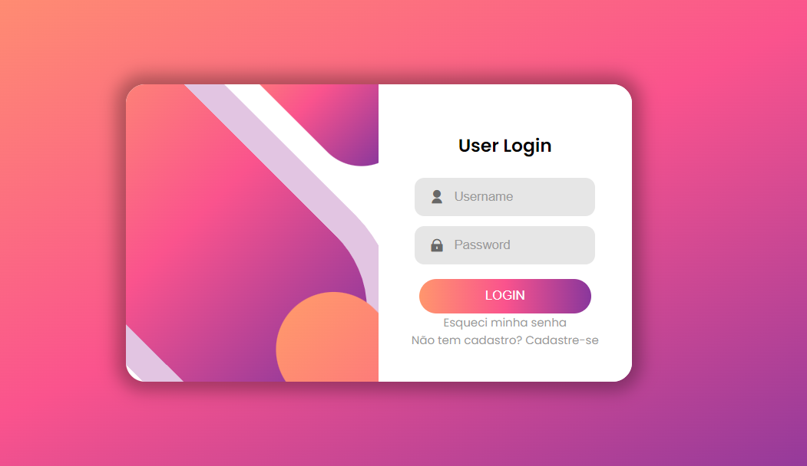
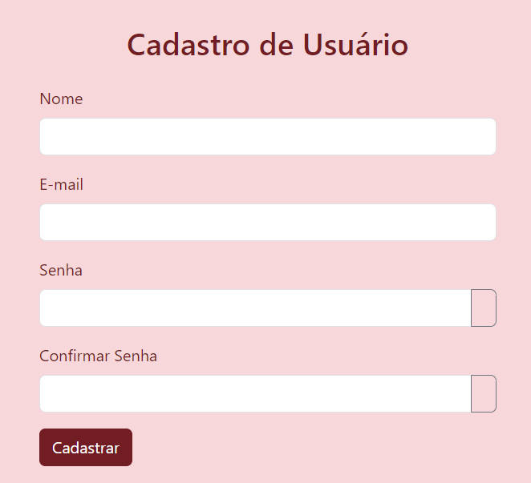
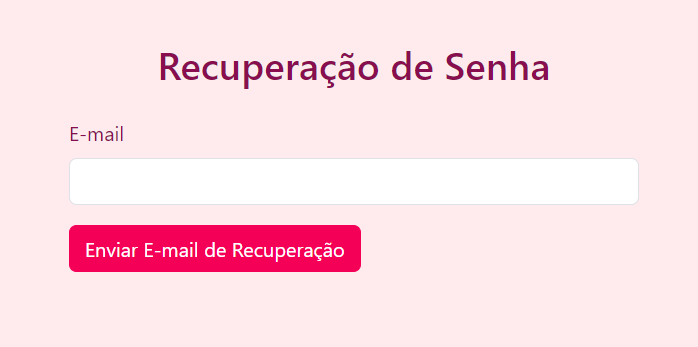

# 🌸 Bem-vindo ao Projeto: Tela de Login Funcional 🚀

Este projeto representa uma jornada envolvente em direção a uma experiência de login sofisticada e altamente funcional. Baseado em um projeto anterior desenvolvido no ano passado durante o curso de Websites, dedicamos esforços para expandir suas funcionalidades com recursos adicionais, como recuperação de senha e cadastro de novos usuários. Essas adições foram cuidadosamente integradas em páginas separadas, proporcionando aos usuários uma experiência mais completa e intuitiva. O resultado é uma plataforma que não só simplifica o processo de login, mas também oferece um conjunto abrangente de ferramentas para atender às necessidades variadas dos nossos usuários

# ℹ️ Explorando o Projeto:
Neste desafio acadêmico, nos dedicamos intensamente à criação de uma tela de login robusta e altamente funcional, enriquecida com diversos recursos de validação de campos implementados por meio do poderoso JavaScript. Além disso, decidimos ultrapassar os limites convencionais ao introduzir páginas dedicadas ao cadastro de novos usuários e à recuperação de senhas, incluindo requisitos de confirmação de senha e um alerta para garantir que as senhas coincidam, além de um ícone de retorno à página inicial. Essa abordagem abrangente e proativa não apenas aprimora a segurança e a usabilidade do sistema, mas também proporciona uma jornada completa e sem obstáculos para os nossos usuários, assegurando uma experiência de primeira classe em todas as etapas do processo de interação com a plataforma.

# 🎨 Estilo e Design:
A estética delicada deste projeto foi meticulosamente planejada para criar uma atmosfera visualmente agradável. Misturei fontes suaves e elementos visuais harmoniosos para oferecer uma experiência de usuário memorável e cativante.

# 🧩 Linguagens ultilizadas

🔧 > HTML: Estruturação do conteúdo da página, incluindo formulários de login, cadastro de novos usuários e recuperação de senha.

🎨 > CSS: Estilização dos elementos HTML, como cores, fontes, layout e responsividade, garantindo uma apresentação visualmente atraente e consistente em diferentes dispositivos.

💻 > JavaScript: Implementação de validação de campos de entrada, interações de usuário dinâmicas e lógica de negócios para funcionalidades como login, cadastro de usuários e recuperação de senha, proporcionando uma experiência interativa e eficiente.

# 🔐 Principais Funcionalidades:

- **Login de Usuário:** Facilitamos o acesso dos usuários à plataforma, permitindo que eles insiram suas credenciais de login com facilidade.

- **Cadastro de Novos Usuários:** Oferecemos uma jornada de cadastro simplificada, onde novos usuários podem preencher os campos necessários e criar suas contas em poucos passos.

- **Recuperação de Senha:** Para garantir uma experiência livre de preocupações, implementamos uma funcionalidade de recuperação de senha. Os usuários podem simplesmente clicar na opção "Esqueci minha senha" para iniciar o processo de recuperação via e-mail.

# ❤️ veja a ilustração do meu projeto!

# 🎉 linkedin
Este projeto será documentado no LinkedIn para compartilhar meu trabalho e experiência com a comunidade.

# *📝 Autoria:*
Este projeto é uma criação ´´Luamy Alves Gama´´ desenvolvido com paixão e dedicação para proporcionar uma experiência excepcional aos usuários.